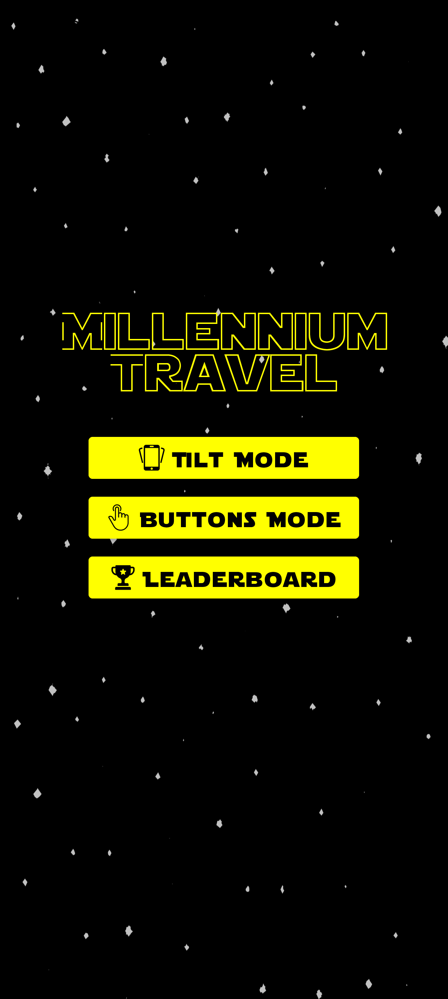
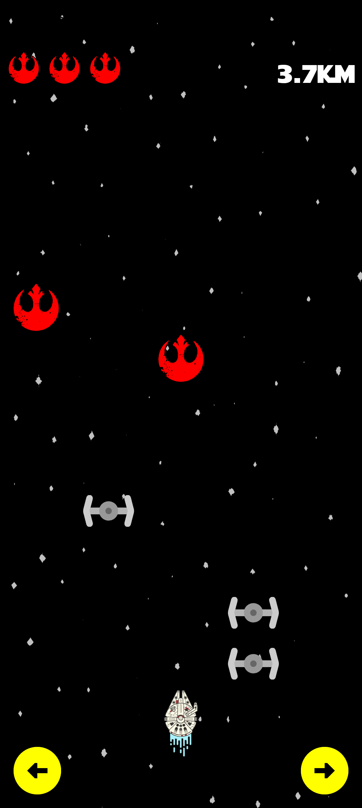
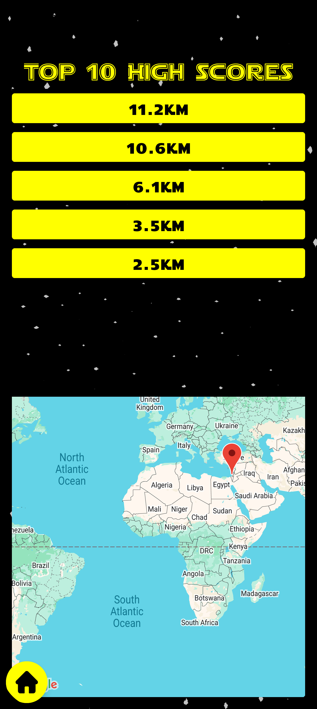

# 🚀 Millennium Travel

## Overview
Millennium Travel is a Star Wars–themed Android driving game built in Kotlin. You pilot a starship through a five-lane hyperspace road, dodging enemy ships and collecting extra life points while your odometer tracks how far you've traveled.

## 🛠️ Features
- **Dual Control Modes**: Players can choose between two steering modes selectable from the main menu:
	- **Buttons Mode**: Tap the left/right buttons to change lanes.
	- **Tilt Mode**: Tilt the device left or right to steer.
- **Controllable Speed**: Tilt the device forward/backward to adjust speed in real time.
- **Location-Based Leaderboard**: High scores are stored locally (using `SharedPreferences`) with the player's name and GPS coordinates (using `Google Maps SDK`).
- **Interactive Map**: Clicking a high score on the leaderboard zooms into the specific location where that score was achieved.
- **Sound Effects**: Background music during gameplay and an explosion sound upon losing the last life point.
  
## 🏃‍♂️‍➡️ Getting Started

1. Clone the repository and open it in Android Studio.
2. Add your Google Maps API key to `local.properties`:
	```properties
 	MAPS_API_KEY=YOUR_API_KEY
3. Build and run on a physical device (minSdk 36).

## 📱 App Flow & Views

### 1. Main Menu
The screen that you see when you open the app.
- The first time you launch the app, you will be prompted with a **location permission request**; accepting will allow saving your location upon getting a high score.
- On this screen, you can choose to start a new game by selecting one of the steering modes or go to the leaderboard screen.
<div align="center">
  
</div>

### 2. Gameplay
The game screen shows obstacles moving toward you at a constant speed. Your ship sits at the bottom of the screen and can move across five lanes. Survive as long as you can with your three lives by steering the ship.
- **Enemy ships**: Hit one and you lose a life. The game ends when all three lives are gone.
- **Rebel Alliance logos**: Collecting one restores a lost life.
- **Score / Odometer**: Distance is shown live during the game and converts from meters to kilometers automatically. On game over, your final distance is shown in a toast notification.,kl  
<div align="center">
  
</div>


### 3. Game Over
When the last life is lost:
- An **explosion sound** plays and the device **vibrates**.
- A **Toast message** announces the distance you traveled.
- Your score (along with your current GPS coordinates) is saved to the **leaderboard** if it ranks in the top 10.
- The app returns to the main menu automatically.

### 4. Leaderboard
A split-screen view displaying the top 10 runs, each showing the distance achieved as a tappable button, and a **Google Map**.
Tapping a score pans the embedded **Google Map** to the location where that run ended, marked with a pin.
When there are too many scores and some of them are hidden, you can scroll down the list to them.
<div align="center">
  
</div>

## ⚠️ Limitations
- The app only works for devices with SDK 36 and above.
- The device's orientation should be locked, or else the game will break.
